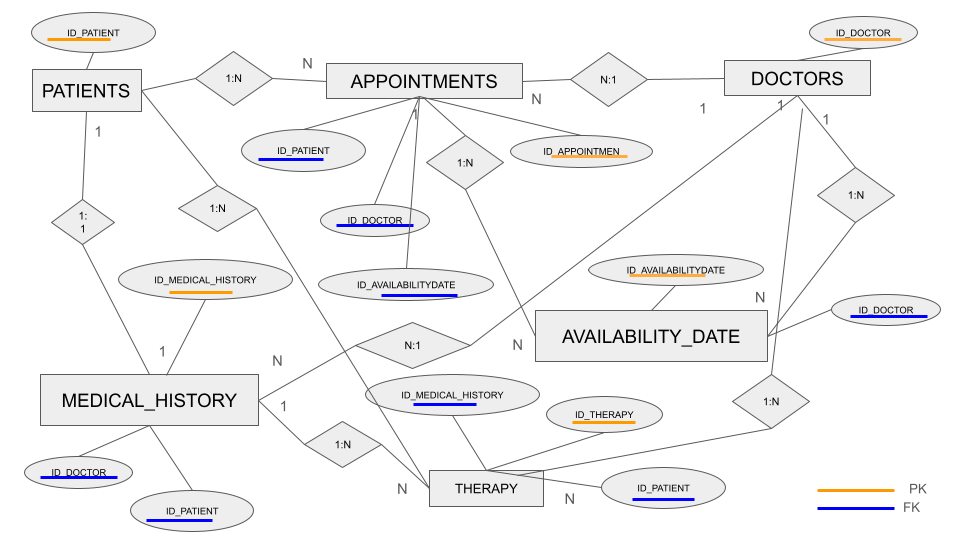

# Documentación

# Desafío de Diseño: Sistema de Gestión Medica 👩🏽‍⚕️💻

## Problema
Nuestro equipo de desarrollo está inmerso en la creación de un sistema de gestión para calendarizar turnos medicos, especializandose en turnos de terapia psicologica, pudiendo crecer para otras especialidades medicas dentro del centro medico. Nos enfrentamos al emocionante desafío de diseñar una base de datos eficiente que maneje de manera óptima todas las operaciones relacionadas con la información de pacientes, médicos, citas, historias médicas y terapias.

## Descripción del Problema
1. **Gestión Integral de Pacientes y Medicos**:
   Necesitamos una base de datos que permita registrar de manera detallada la información de los pacientes que ingresan al centro médico, así como del personal médico involucrado en el proceso. Es fundamental diferenciar entre las diversas especialidades médicas ofrecidas en el centro para una gestión integral y efectiva.

2. **Gestión de turnos medicos y Disponibilidad Óptima**:
   La base de datos debe permitirnos registrar la disponibilidad de turnos médicos según la especialidad del médico, gestionar el ingreso de los pacientes y mantener actualizado el estado de los turnos médicos (ocupado o disponible). Esto garantizará una asignación eficiente entre turnos, médicos especialistas y pacientes, evitando conflictos y mejorando la atención al paciente.

3. **Privacidad y confidencialidad**
    Es crucial que los recursos de la base de datos sean manipulados únicamente según los roles correspondientes, asegurando la privacidad y confidencialidad de los datos tanto de los pacientes como de los médicos especialistas. Se debe implementar una capa de seguridad robusta para proteger la integridad de la información confidencial.

4. **Registro Detallado de las Historias Medicas**:
   El sistema debe registrar minuciosamente cada ingreso de paciente, incluyendo la fecha y hora, datos personales del paciente, médicos especialistas que lo atendieron y el registro de terapias realizadas. Este nivel de detalle nos permitirá llevar un control preciso de la evolución de cada paciente y mejorar la calidad de la atención médica.

5. **Registro Detallado de las Terapias**:
    Es fundamental mantener un registro detallado de cada terapia realizada, su gestión y seguimiento en relación con el paciente. Esto permitirá una optimización de los recursos médicos, ayudando a los médicos especialistas a obtener conclusiones más acertadas para sus pacientes y mejorar la calidad de vida de estos últimos.

## Entidades Principales

1. **Pacientes:**
    Cada paciente tiene un: 
    IDúnico: number,
    nombre: string, 
    apellido: string, 
    fecha de nacimiento: date, 
    género: string, 
    dirección: string, 
    número de teléfono: number.
        **TABLA**
        patients(
        id_patient INT AUTO_INCREMENT PRIMARY KEY,
        first_name VARCHAR(100) NOT NULL,
        last_name VARCHAR(100) NOT NULL,
        email VARCHAR(100) UNIQUE NOT NULL,
        birth DATE,
        gender VARCHAR(10),
        address VARCHAR(255),
        phone VARCHAR(20))

2. **Médicos:**
    Cada médico tiene un:
    IDúnico: number, 
    nombre: string, 
    apellido: string, 
    especialidad: string, 
    número de teléfono: number,
    sala en la que consulta: number.
        **TABLA**
        doctors(
        id_doctor INT AUTO_INCREMENT PRIMARY KEY,
        first_name VARCHAR(100) NOT NULL,
        last_name VARCHAR(100) NOT NULL,
        email VARCHAR(100) UNIQUE NOT NULL,
        speciality VARCHAR(100),
        phone VARCHAR(20),
        room VARCHAR(100))

3. **Citas:**
    Las citas están asociadas: 
    IDunico: number,
    IDpaciente : number, 
    IDmédico específicos : number, 
    fecha de la cita: date, 
    hora de la cita: date.
        **TABLA**
        appointments(
        id_appointment INT AUTO_INCREMENT PRIMARY KEY,
        id_patient INT,
        id_doctor INT,
        appointment_date DATE NOT NULL,
        appointment_time TIME NOT NULL,
        status ENUM('Pending', 'Confirmed', 'Cancelled', 'Completed') DEFAULT 'Pending')
    
4. **Disponibilidad de Médicos:**
    Registra la disponibilidad de los médicos para citas.
    Incluye:
    IDunico: number, 
    IDdoctor: number, 
    fecha disponible: date, 
    hora disponible: date,
    estado: string,
    comentarios: string.
        **TABLA**
        availabilityDate (
        id_availability_date INT AUTO_INCREMENT PRIMARY KEY,
        id_doctor INT,
        availability_date DATE NOT NULL,
        availability_time_from TIME NOT NULL,
        availability_time_to TIME NOT NULL,
        status ENUM('Available', 'Booked', 'Cancelled') DEFAULT 'Available',
        comment VARCHAR(255)
        )

5. **Historias Médicas:**
    Cada historial médico tiene un:
    IDúnico: number,  
    IDpaciente: number, 
    IDmédico: number,  
    fecha de concurrencia: date, 
    detalles de la visita: string, 
    diagnóstico: string,
    tratamiento: string.
        **TABLA**
        medical_history (
        id_history INT AUTO_INCREMENT PRIMARY KEY,
        id_patient INT,
        id_doctor INT,
        concurrence_date TIMESTAMP DEFAULT CURRENT_TIMESTAMP,
        details TEXT,
        diagnosis TEXT,
        treatment TEXT
        )

6. **Terapias:**
    Las terapias están asociadas A:
    IDunico: number,
    IDpaciente: number, 
    IDmédico: number,
    fecha de sesión: date, 
    detalles de la sesión: string, 
    progreso: string,
    observaciones: string.
        **TABLA**
        therapy(
        id_session BINARY(16) PRIMARY KEY DEFAULT (UUID_TO_BIN(UUID())),
        id_patient INT,
        id_doctor INT,
        session_date DATE,
        details TEXT,
        progress TEXT,
        obs TEXT
        )

## Objetivo
El objetivo principal es crear una base de datos que permita a un centro médico gestionar de manera efectiva la información de pacientes, médicos, citas, historias médicas y terapias. Esta base de datos debe ser fácil de mantener, escalable y garantizar la integridad de los datos, permitiendo así una gestión ágil y precisa de todas las operaciones médicas.

## Diagrama Entidad Relación

